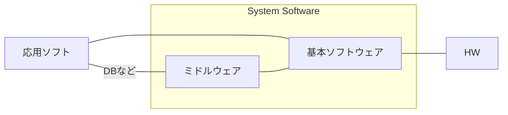
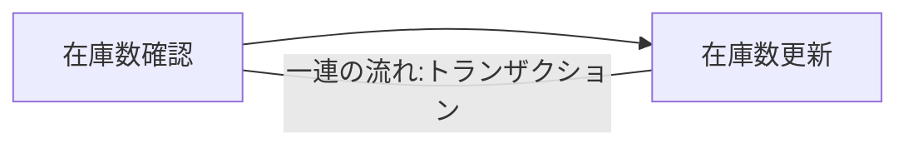

# 初学者がまず知っておきたいDB入門

スクールなどではフレームワークの使い方や教材に沿ったアプリ開発などを学ぶと思いますが、圧倒的に基礎が足りていない状態だと思います。
面接官は結構そのことを見抜いていて、DBに関する質問をよく投げてきます。
「インデックスは貼ったか」「正規化とはなにか」「トランザクションは説明できるか」など。。。

これらは基本情報を勉強していると必ず出てくる知識ですので、先輩の言うことがわからないという状況を回避するためにも抑えておくことが望ましいと思います。
ここでは最も汎用的なリレーショナルデータベースを基にお話します。

## DBとは

DBMSはDBの定義や操作制御などの機能をもつミドルウェア。
特定の処理を行う応用ソフトウェアと、HWとの仲介役となる基本ソフトウェアの間に位置します。
見た目がエクセルのようにみえますが、エクセルはデータから表を表現するためのソフト、DBはデータを貯めたり提供したりするミドルウェアです。



## 正規化

DBの重複除去や整合性を保つために行う一連の操作のことを、正規化といいます。


>http://kanauka.o-oku.jp/4_jyohosystem/visio/seikika.gif

繰り返し部分の切り出すことを**第１正規型**といいます。

### 関係従属

**主キー**が決まれば列の値が一意に定まる関係を関数従属という。
主キーに関数従属した表を切り出すと**第２正規型**
主キー以外に関数従属している表を切り出すと**第３正規型**となる

## 主キー

テーブル内で内容が重複しない＋空でないキー
複数の列を組み合わせれば一意になるキーは**複合キー**という

## 外部キー

表と表を関係付けるため、他の表の主キーを参照すること


>https://xtech.nikkei.com/it/members/ITPro/ITBASIC/20000919/1/zu02.gif

## 演算

射影は列を取り出す演算　SELECT
選択は特定のレコードのみを取り出す演算　SELECT + WHERE

## 3層スキーマ

データの独立性を高める目的

- 外部スキーマ　ユーザがアプリケーションから見るデータ群
- 概念スキーマ　DBそのもの、テーブル設計、キー設定、リレーションなど開発者が見る部分
- 内部スキーマ　ディスクにどう格納するかの設計


>https://image.itmedia.co.jp/ait/articles/1703/01/r20_04-01.PNG

## SQL

```sql

-- HAVING
-- Group化した中から条件に合致するものだけを抽出

select id, name ,avg(value) from table
where in id (1,2,3,4)
group by name
  having avg(value) > 200

```

## トランザクション管理と排他制御

同時にカラムやテーブルを編集してしまったときに不整合が起きないようにする仕組み

### トランザクション



### 排他制御

データをロックする機能
- 共有ロック　他のユーザも読むことはできる
- 専有ロック 読み書きできない

複数のトランザクションでお互いにロックを掛けてしまい、永遠に解除を待ち続ける状態を**デッドロック**という

### ACID特性

- Atomicity 正常に終われば処理、異常なら実行しない
- Consistency　DBの内容に矛盾がないこと
- Isolation 複数人で同時にクエリが実行されても相互に影響させない様にする
- Durability　障害が発生してもトランザクションの更新結果は保証される（復旧手段が保証される）


### ストアドプロシージャ

SQL文を1つのプログラムにまとめ、DBMS側に保存しておくこと。
クライアントはプロシージャを呼び出すだけで実行できる＝通信量削減

関数的な使い方ができる

```sql
CREATE PROCEDURE sample02( IN x INT )
SELECT x + 1;
実行結果
mysql> CALL sample02( 2 );
+-------+
| x + 1 |
+-------+
|     3 |
+-------+
1 row in set (0.00 sec)

Query OK, 0 rows affected (0.00 sec)
```

## DB障害管理

バックアップやジャーナルファイルを使う。
ジャーナルはバックアップ前後の差分をログファイルとして更新履歴を管理する。

### コミットとロールバック

トランザクションのAtomicityに従って更新処理の確定をする＝コミット
送金主の残高は減っているのに受け取り側の残高が増えていないといった事象を防ぐ

障害が発生した場合は、トランザクションを破棄し更新前ジャーナルを使ってロールバックする

### 分散DBと2相コミット

見かけ上1つのDBだが各サイトに散してシステムが組まれている場合がある。
コミットするとき、全てのサイトに問合せ、全て処理可能な状況なら許容する。
1つでも不可ならロールバックする。これを２相コミットという。

### ロールフォワード

HW障害などでDBが機能しなくなった場合、バックアップファイルから復元し、以降を更新後ジャーナルに従って反映させていく。
一連の手順をロールフォワードという。


