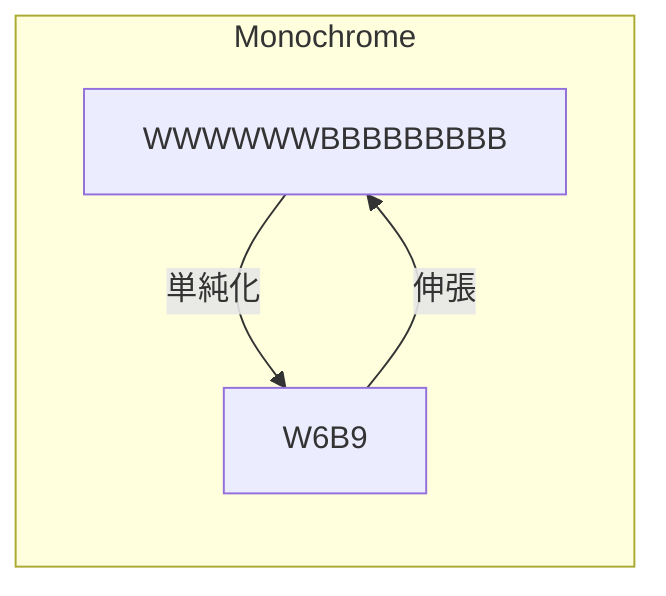

# ファイル管理

ファイルはデータをひとまとめにした単位

## フォーマット

txt, csv, pdf, bmp, png, jpeg, gif, mp3, midi, mpeg...

- jpegは圧縮率高いが劣化
- pngは圧縮率は低いが可逆、劣化しない
- gifは可逆、２５６色までしか扱えない
- bmpは圧縮しない
- mp3は人に聞こえない領域の信号を削ぎ落として圧縮、不可逆
- mpegは不可逆

## 圧縮と伸張

モノクロ画像を例にすると…

## 汎用コンピュータにおけるファイルの概念

汎用コンピュータ＝基幹業務などで使われる大型コンピュータ

### ファイルはレコードの集合

概念としてはDBと同義

アクセス方法が3つに大別される

1. 順次アクセス　先頭レコードからアクセス　テープデバイスなど
2. 直接アクセス　任意レコードにアクセス　CD,HDDなど
3. 動的アクセス　任意レコードにアクセスした以降、順次アクセスする

### ファイル編成法

#### 順編成ファイル

  先頭から順に記録　無駄がない、大量処理が得意<->追加、削除などが苦手

#### 直接編成ファイル

任意のアドレスに記録　追加削除楽<->記憶域の使用効率は悪い

- 直接アドレス方式　ファイルのキー値をそのまま格納アドレスとして用いる
- 間接アドレス方式　ハッシュ関数を用いた計算結果を格納アドレスとする　重複（シノニム）が生じることがあり、多発するとアクセス速度が落ちる

#### 索引編成ファイル

索引域、基本データ域、あふれ域で構成。索引に依る直接アクセスと先頭からの順次アクセスの両方の特性をもつ。

#### 区分編成ファイル

- ディレクトリ域＝アドレス管理
- メンバ域＝順編成ファイルを格納する
- メンバの削除追加は楽だが、レコード単位の追加削除は苦手
- 主にプログラムやライブラリに使う

