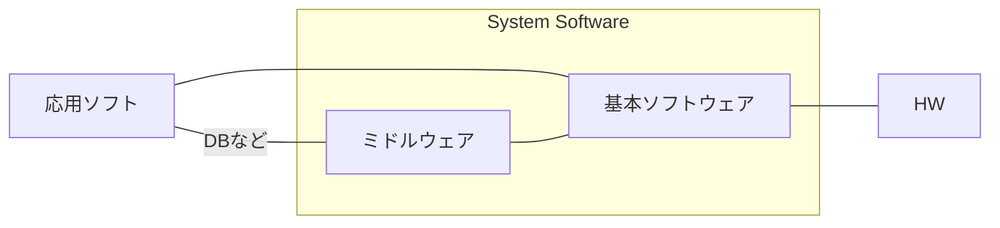
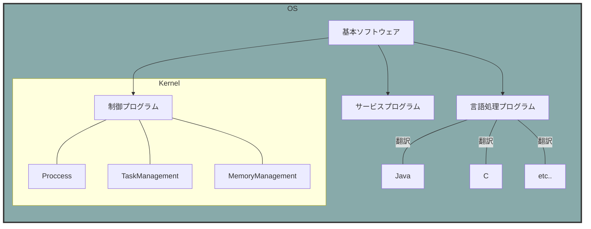
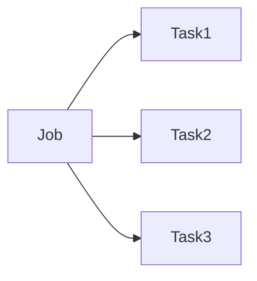
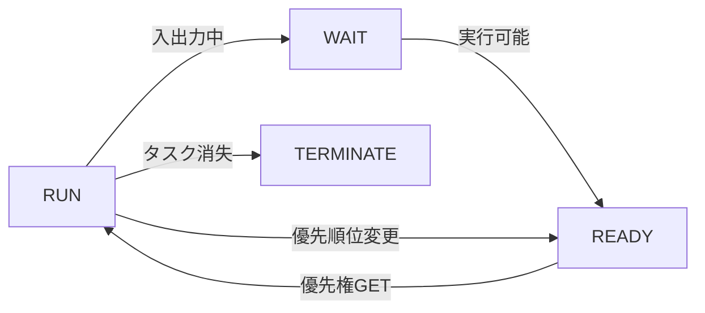

# OS

+ メモリ管理
+ ファイル管理
+ HW管理

## ソフトウェア分類

## API

アプリケーション側からOSの機能を呼び出すためのインターフェース

+ 開発効率アップ
+ 操作性の統一
+ 互換性の確保

## タスク管理

### Jobは実行単位であるtaskに分解される

### Taskの状態遷移

タスクがたまっていき、使用権を得るまで待つ。
使用権を管理するのはディスパッチャの役割。

### ディスパッチャ

+ 到着順
+ 優先順
+ ラウンドロビン...一定時間単位で使用権の付与、終わらないタスクは最後に回される

