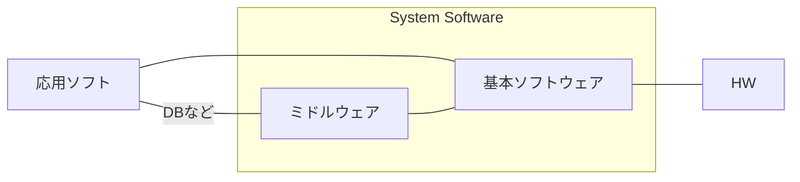
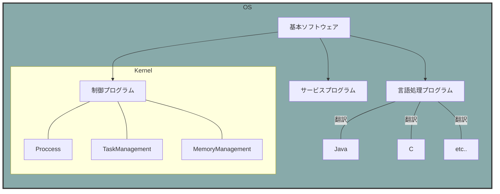
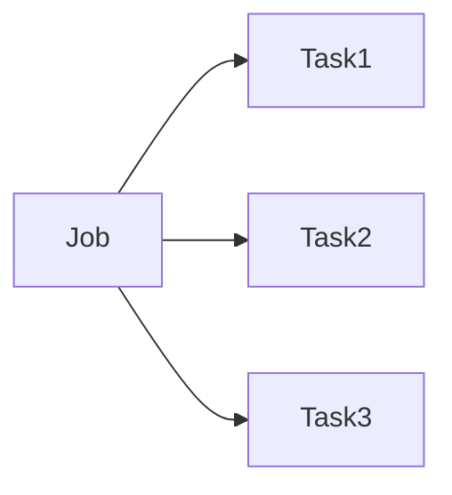
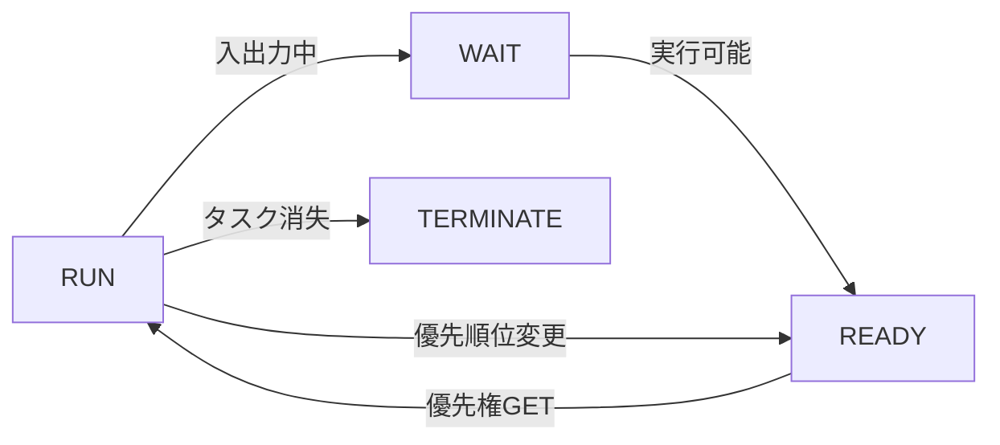
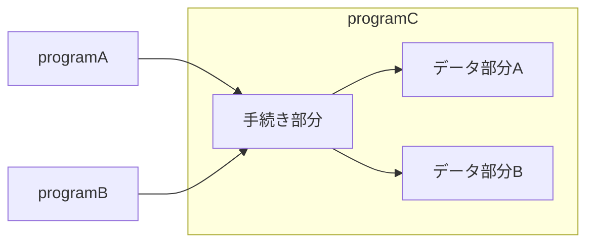
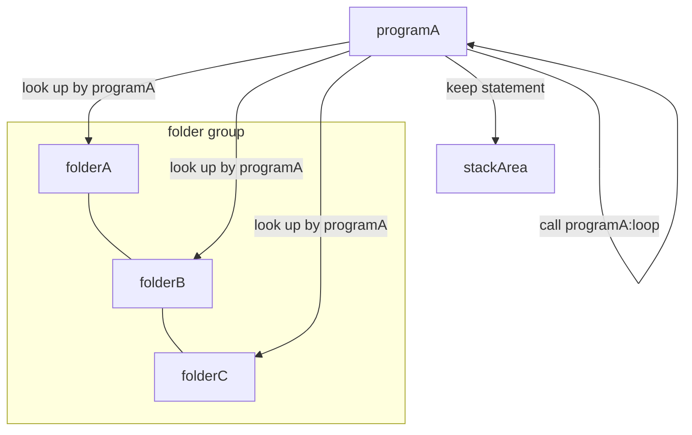

# OS

- メモリ管理
- ファイル管理
- HW管理

## ソフトウェア分類





## API

>アプリケーション側からOSの機能を呼び出すためのインターフェース

- 開発効率アップ
- 操作性の統一
- 互換性の確保

## タスク管理

### Jobは実行単位であるtaskに分解される



### Taskの状態遷移



タスクがたまっていき、使用権を得るまで待つ。
使用権を管理するのはディスパッチャの役割。

### ディスパッチャ

- 到着順
- 優先順
- ラウンドロビン...一定時間単位で使用権の付与、終わらないタスクは最後に回される

## マルチプログラミング

> CPUの遊休時間を減らすために処理を並行して行う

```mermaid
gantt
dateFormat  ss
title Multi Programming
section A section

Active CPU               :active,  des2, 1, 3s
Future task1               :         des3, after des2, 5s
Future task2               :         des4, after des3, 5s
Active CPU               :des2, a, 3s
```

## 実記憶管理

限られた主記憶空間を効率良く使うための管理方法

### 固定区画

>固定長のパーティションに区切り、プログラムを割り当てる

### 可変区画

>プログラムをロードする過程で必要なサイズに区切る

### フラグメンテーション＆メモリコンパクション

可変で良いように見えるがプログラムの終了が上から順とは限らない=> 断片化する

**これを解決するのがメモリコンパクション（ガベージコレクション）**
断片化した領域にプログラムを並べ直す。

### オーバーレイ方式

> そもそも実行したいプログラムが容量より大きいとロードできないので、プログラムをセグメント化し必要な文だけをメモリにロードする方法

### スワッピング方式

> 割り込み処理などの際、優先度の低いプログラムを補助記憶装置へ一旦退避させる

## 再配置可能なプログラム

メモリのアドレスが変わるけど大丈夫なのか問題。
=> **ベースアドレス方式**でロードされたときの先頭アドレスからの差分でアドレス位置を指定できる。

そのため、どこにロードされても大丈夫。このような性質のプログラムを再配置可能プログラムという。

- 再配置可能　どこにロードされても大丈夫
- 再使用可能　再ロードせず繰り返し実行できる
- 再入可能　データ部分をタスクごとに持つことで複数タスクから呼び出しても干渉しない



- 再帰的　実行中に自分自身を呼び出せる(仮にProgramAとすると) 

