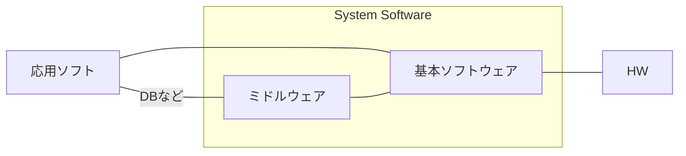
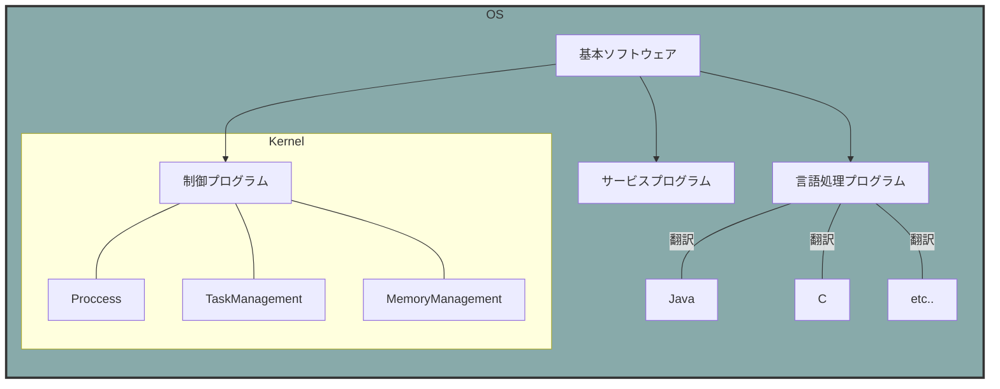
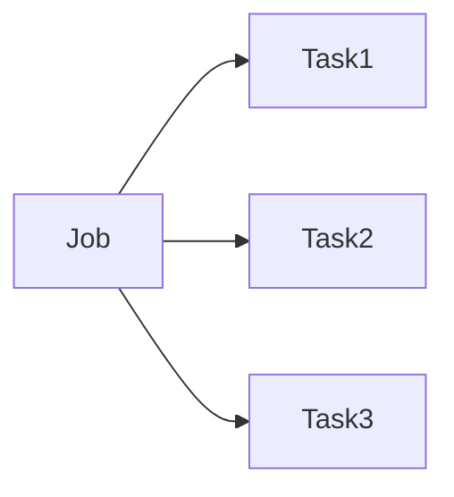
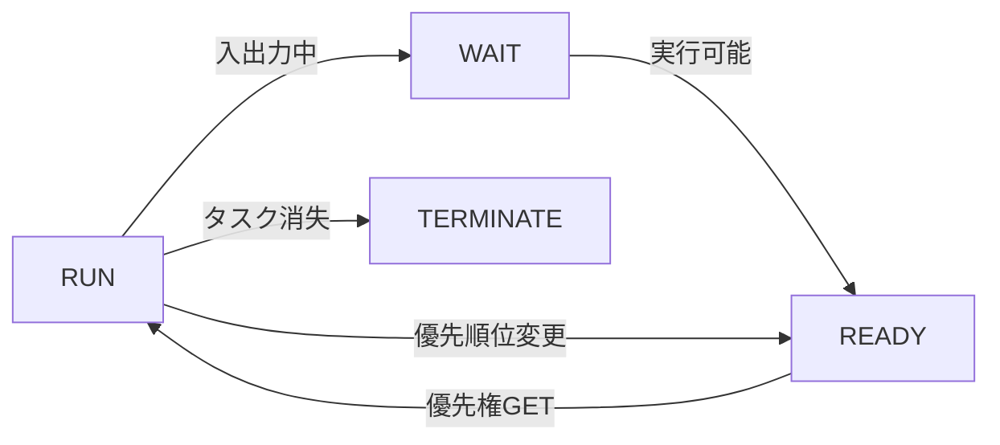
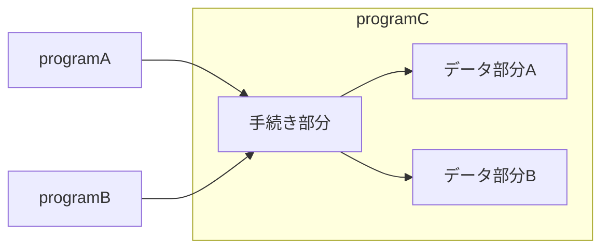
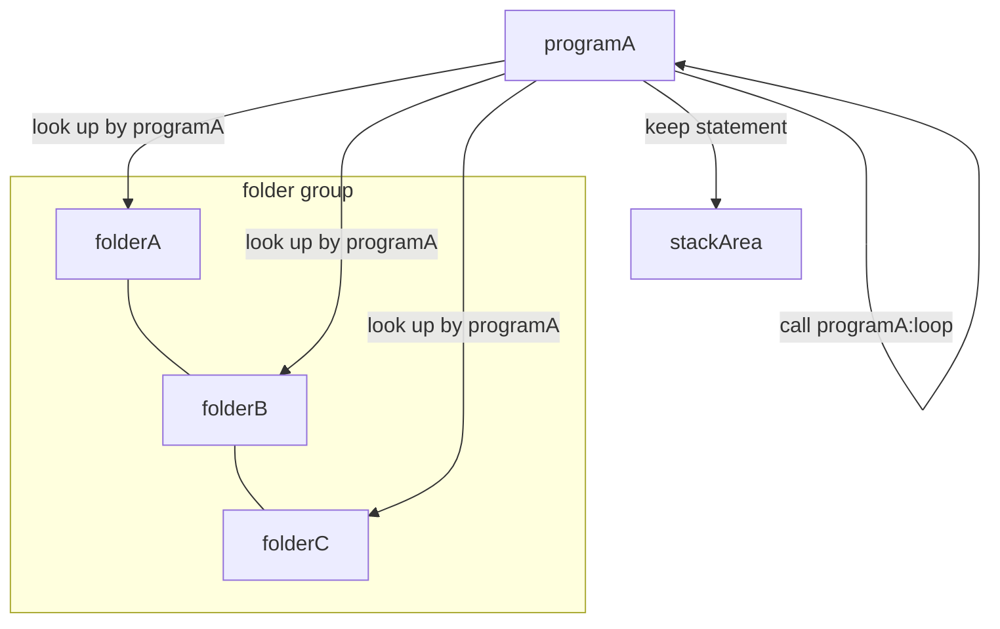
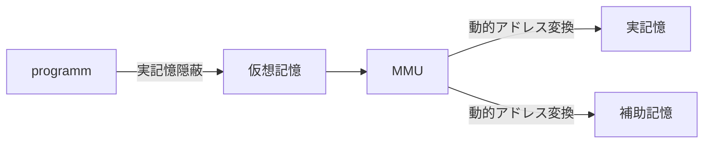
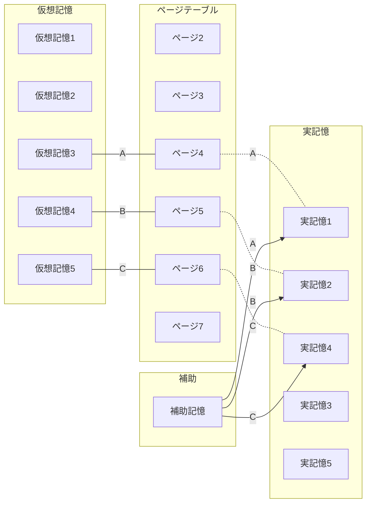

# OS

- メモリ管理
- ファイル管理
- HW管理

## ソフトウェア分類





## API

>アプリケーション側からOSの機能を呼び出すためのインターフェース

- 開発効率アップ
- 操作性の統一
- 互換性の確保

## タスク管理

### Jobは実行単位であるtaskに分解される



### Taskの状態遷移



タスクがたまっていき、使用権を得るまで待つ。
使用権を管理するのはディスパッチャの役割。

### ディスパッチャ

- 到着順
- 優先順
- ラウンドロビン...一定時間単位で使用権の付与、終わらないタスクは最後に回される

## マルチプログラミング

> CPUの遊休時間を減らすために処理を並行して行う

```mermaid
gantt
dateFormat  ss
title Multi Programming
section A section

Active CPU               :active,  des2, 1, 3s
Future task1               :         des3, after des2, 5s
Future task2               :         des4, after des3, 5s
Active CPU               :des2, a, 3s
```

## 実記憶管理

限られた主記憶空間を効率良く使うための管理方法

### 固定区画

>固定長のパーティションに区切り、プログラムを割り当てる

### 可変区画

>プログラムをロードする過程で必要なサイズに区切る

### フラグメンテーション＆メモリコンパクション

可変で良いように見えるがプログラムの終了が上から順とは限らない=> 断片化する

**これを解決するのがメモリコンパクション（ガベージコレクション）**
断片化した領域にプログラムを並べ直す。

### オーバーレイ方式

> そもそも実行したいプログラムが容量より大きいとロードできないので、プログラムをセグメント化し必要な文だけをメモリにロードする方法

### スワッピング方式

> 割り込み処理などの際、優先度の低いプログラムを補助記憶装置へ一旦退避させる

## 再配置可能なプログラム

メモリのアドレスが変わるけど大丈夫なのか問題。
=> **ベースアドレス方式**でロードされたときの先頭アドレスからの差分でアドレス位置を指定できる。

そのため、どこにロードされても大丈夫。このような性質のプログラムを再配置可能プログラムという。

- 再配置可能　どこにロードされても大丈夫
- 再使用可能　再ロードせず繰り返し実行できる
- 再入可能　データ部分をタスクごとに持つことで複数タスクから呼び出しても干渉しない



- 再帰的　実行中に自分自身を呼び出せる(仮にProgramAとすると) 



## 仮想記憶管理

主記憶と補助記憶を組み合わせて、大量の記憶装置があるように見せる。
物理的な記憶装置は実記憶という。

実際のデータは実記憶に保存されるが、物理的存在を隠蔽することで保管されるプログラム自体は何も考えなくて済む！->フラグメンテーションなどの問題をプログラムが考えなくていい

### 動的アドレス変換

仮想アドレス->実アドレスへの変換

- MMU(Memory Management Unit)が担当
- MMUはCPUに内蔵

### なぜ実記憶よりも大きなサイズを扱えるか

-> 実記憶だけでなく、補助記憶にも拡大して保存するため



### 仮想記憶の方式 

- ページング方式　仮想アドレス空間を固定長に区切る
- セグメント方式　仮想アドレス空間を可変長に区切る

仮想記憶と実記憶の紐付けはページテーブルで管理される

#### ページテーブルimage

| ページ   | 存在 | 物理ページアドレス |
|-------|----|-----------|
| ページ0  | 0  |           |
| ページ1  | 0  |           |
| ページ2  | 0  |           |
| ページ3  | 0  |           |
| ページ4  | 1  | ページ5      |
| ページ5  | 1  | ページ7      |
| ページ6  | 1  | ページ3      |
| ページ7  | 1  | ページ9      |
| ページ8  | 0  |           |
| ページ9  | 1  | ページ10     |
| ページ10 | 1  |           |
| ページ11 | 0  |           |
| ページ12 | 0  |           |
| ページ13 | 0  |           |
| ページ14 | 0  |           |
| ページ15 | 0  |



一旦仮想記憶に読み込んだら、補助記憶装置に読み込ませておき、
必要になった時点で実記憶に読み込む->デマンドページング

