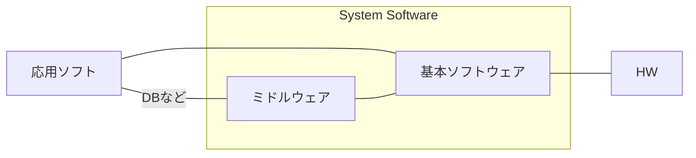
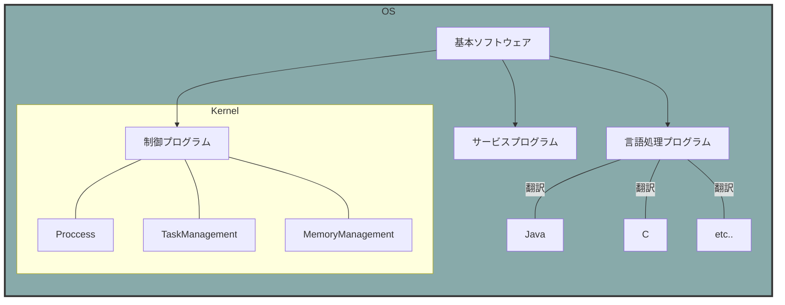

# OS

+ メモリ管理
+ ファイル管理
+ HW管理

## ソフトウェア分類

```mermaid
graph LR;
  応用ソフト --- |DBなど|ミドルウェア
  応用ソフト --- 基本ソフトウェア
subgraph System Software
  ミドルウェア --- 基本ソフトウェア
end
  基本ソフトウェア --- HW
```

```mermaid
graph LR;
subgraph OS
  基本ソフトウェア-->制御プログラム
  基本ソフトウェア-->言語処理プログラム
  基本ソフトウェア-->サービスプログラム
    subgraph Kernel
      制御プログラム---Proccess
      制御プログラム---TaskManagement
      制御プログラム---MemoryManagement
    end
  
    言語処理プログラム---|翻訳|Java
    言語処理プログラム---|翻訳|C
    言語処理プログラム---|翻訳|etc..
  
  
    サービスプログラム
  
end
style OS fill:#8aa,stroke:#333,stroke-width:3px,color:fff
```

## API

アプリケーション側からOSの機能を呼び出すためのインターフェース

+ 開発効率アップ
+ 操作性の統一
+ 互換性の確保
